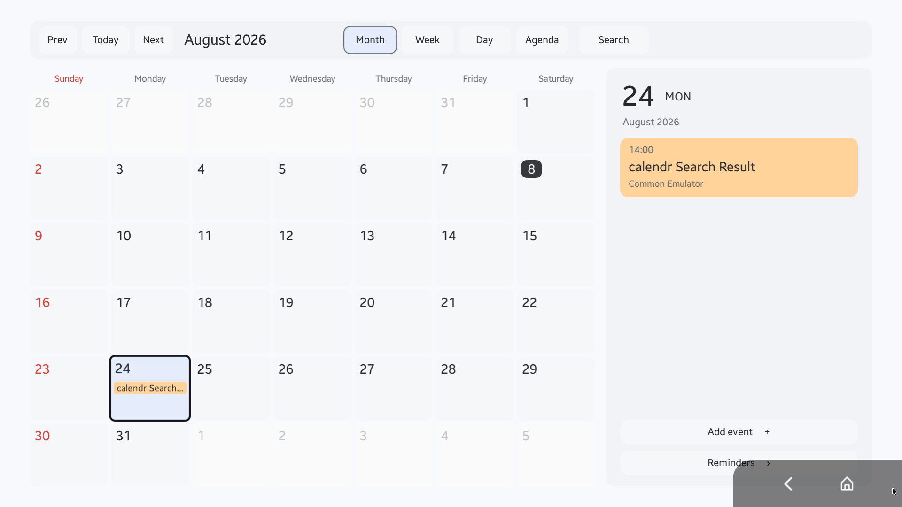
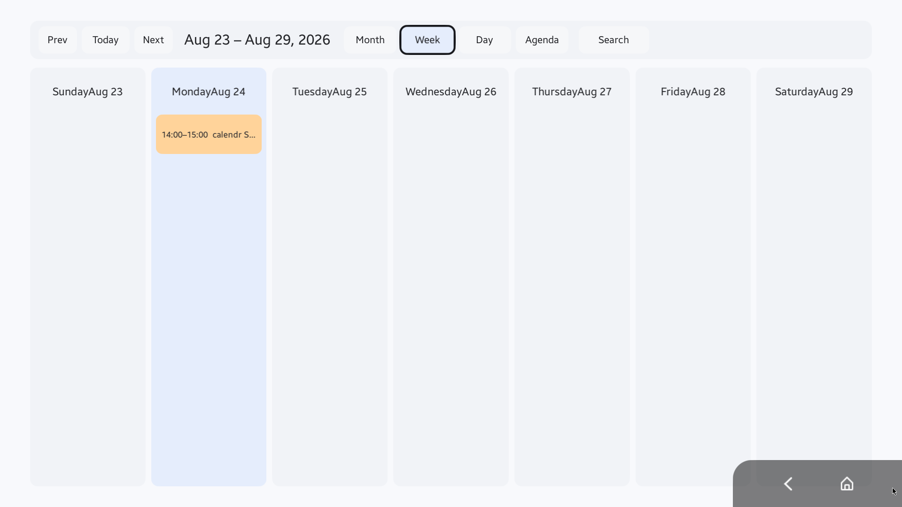
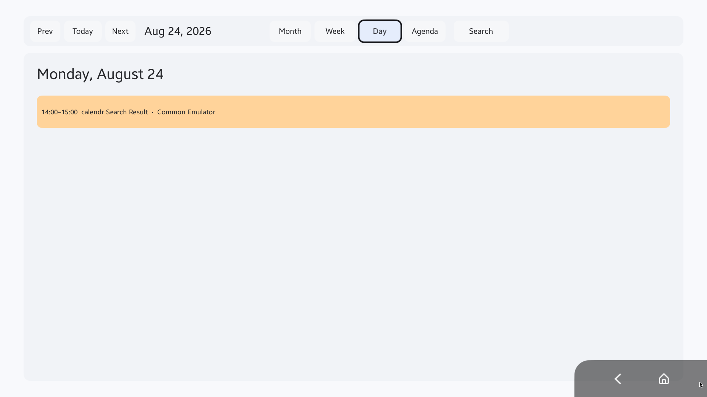
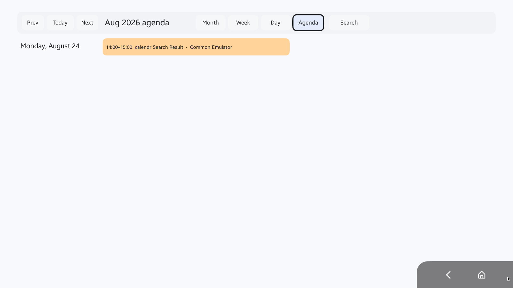
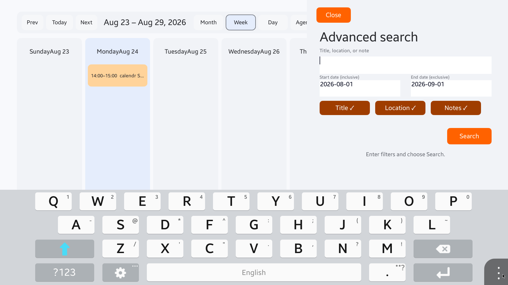
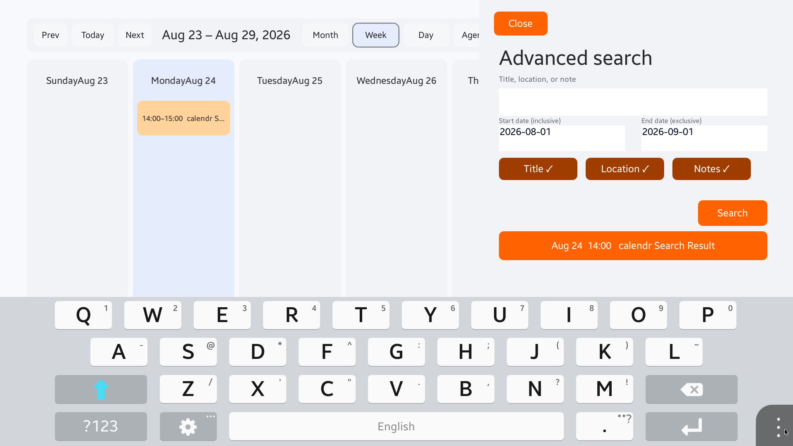
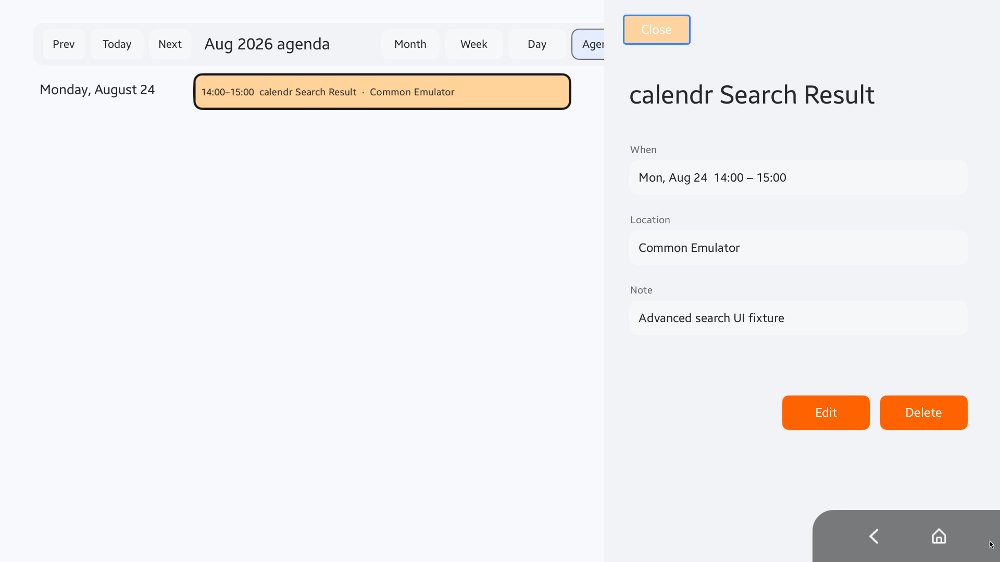

# Calendar

Tizen Action Framework 2.0의 Calendar domain을 실제 NUI 앱, typed Action provider, ViewAnnotation, A2UI presentation으로 연결한 기준 예제입니다.

Calendar는 단순 UI sample이 아닙니다. Month/Week/Day/Agenda 화면과 고급 검색을 같은 app-owned repository 위에 구현하고, 화면에 실제로 렌더된 일정의 stable Entity identity·bounds·focus를 Agent가 조회할 수 있도록 제공합니다.



> 위 이미지는 `emulator-26101` Public Tizen Common Emulator에서 실행 중인 최신 TPK를 Aurum gRPC `takeScreenshot`으로 직접 캡처한 1920×1080 화면입니다. 화면의 일정은 E2E fixture data입니다.

## 주요 기능

- 하나의 Command Bar에서 `Prev`, `Today`, `Next`, Month/Week/Day/Agenda, Search 제공
- Month, Week, Day, Agenda projection이 동일한 UI state/reducer/repository 공유
- TV D-pad/Enter와 pointer가 동일한 semantic `CalendarUiCommand` 실행
- array index가 아닌 `CalendarEvent.Id` 기반 stable focus restoration
- Title/Location/Notes를 독립 선택하는 advanced search
- UI/domain/typed Action 전체에서 `[StartInclusive, EndExclusive)` 기간 semantics
- local timezone과 DST 경계를 고려한 날짜-only boundary 변환
- 기존 `Calendar_Search(Tizen.Entity.Query)` ABI 유지
- typed `CalendarSearchQuery`와 `Calendar_SearchInPeriod` 제공
- actual NUI view의 bounds와 focus를 포함하는 ViewAnnotation
- generated `TizenEntityCalendar.ToJson()` 기반 Entity context
- A2UI `surfaceUpdate` Template과 `dataModelUpdate` Document
- Calendar CRUD, persistence, reminder/alarm reconciliation

## 화면 둘러보기

### Month

Month 화면은 6주 grid, 선택 날짜, 일정 badge, 선택 날짜의 상세 pane을 함께 제공합니다. 날짜와 일정은 pointer 및 D-pad로 열 수 있습니다.


### Week

Week 화면은 일주일의 실제 렌더 가능한 event card만 표시합니다. renderer와 D-pad focus 대상이 동일한 render policy를 사용하므로 보이지 않는 일정으로 focus가 이동하지 않습니다.



### Day

Day 화면은 선택한 날짜의 일정을 넓은 card로 표시합니다. 시간, 제목, 장소가 한 줄에서 구분되며 event card의 stable ID가 focus와 ViewAnnotation identity로 사용됩니다.



### Agenda

Agenda는 현재 월에서 일정이 있는 날짜만 요약합니다. 표시 가능한 날짜 수는 고정 상수뿐 아니라 실제 content height를 반영합니다.



### Advanced Search

검색은 keyword와 Title/Location/Notes selector를 조합합니다. 날짜 범위는 화면에 명시된 대로 start-inclusive, end-exclusive입니다.



검색을 적용하면 result card가 같은 overlay에 나타납니다. selector가 모두 해제되거나 wire에서 생략된 경우에는 호환성을 위해 전체 검색 필드를 사용합니다.



### Event Detail

일정을 열면 날짜·시각, 장소, 메모와 Edit/Delete action을 표시합니다. Close 후에는 이전 surface와 exact event focus로 돌아갑니다.



## UI interaction model

Command Bar의 visual order:

```text
Prev → Today → Next → period title → Month → Week → Day → Agenda → Search
```

actionable header focus order:

```text
Prev → Today → Next → Month → Week → Day → Agenda → Search
```

pointer activation도 D-pad/Enter와 동일한 reducer command를 dispatch합니다. pointer로 연 control도 먼저 actual NUI focus를 받은 뒤 semantic action을 실행하므로 detail을 닫았을 때 같은 control 또는 event로 복원할 수 있습니다.

## 비례 viewport scaling

Calendar는 플랫폼이 제공하는 `Window.Default.WindowSize`와 `Window.Default.GetInsets()`에서 현재 drawable area를 얻습니다. 1920×1080 design canvas 기준으로 available area의 `min(width / 1920, height / 1080)` uniform scale을 계산하고, 남는 영역은 X/Y offset으로 중앙 정렬합니다.

- physical root는 실제 window와 pillarbox/letterbox 배경을 채웁니다.
- 모든 Calendar page 및 overlay는 top-left 기준의 1920×1080 NUI design canvas 아래에 배치됩니다.
- 단일 ancestor transform이 pane-local spacing, typography, corner radius, border와 focus geometry를 정확히 한 번씩 비례 변환합니다.

- 1920×1080과 1280×720 같은 16:9 화면은 전체 canvas를 비례 축소/확대합니다.
- 1440×1080에서는 scale 0.75, Y offset 135로 세로 중앙 정렬합니다.
- 2560×1080에서는 scale 1.0, X offset 320으로 가로 중앙 정렬합니다.
- Calendar safe inset과 command bar/month/agenda content bounds는 `Window.Default.GetInsets()`로 얻은 platform-available area 및 centered canvas 내부에서 계산합니다.
- Calendar는 상단 44px, 하단 100px의 비대칭 design safe inset을 사용해 Common Emulator navigation overlay 아래에 action이 배치되지 않도록 합니다.
- `Window.Default.Resized` 또는 `InsetsChanged` event가 발생하면 현재 UI state를 유지한 채 새 geometry로 다시 render합니다.
- View Action은 scaled design coordinate를 추정하지 않고 실제 transformed NUI descendant에서 `ScreenBounds`와 `WindowBounds`를 다시 측정합니다. 최신 installed TPK에서 `GetAnnotatedViews`, `FindById`, `ToPresentation`과 missing-ID error path를 wire E2E로 재검증했습니다.

`Calendar.App.Tests`는 위 네 viewport, invalid-size rejection, inset이 drawable area를 소진하는 transient frame skip을 Tizen-free 계산으로 검증합니다. README의 실제 native screenshot은 1920×1080 Common Emulator에서 캡처한 것이며, 1280×720과 non-16:9 값은 deterministic geometry test 범위입니다.

## Advanced Search semantics

`CalendarSearchCriteria`와 typed `CalendarSearchQuery`는 다음 계약을 공유합니다.

```text
[event.Start, event.End) overlaps [StartInclusive, EndExclusive)

⇔ event.End > StartInclusive
  AND event.Start < EndExclusive
```

- timestamp wire input은 explicit UTC offset이 있는 strict ISO 8601 형식
- date-only UI boundary는 app의 local timezone 사용
- DST invalid/ambiguous local time 처리
- case-insensitive keyword matching
- deterministic ordering과 bounded result limit
- Title/Location/Notes field selector
- selector omitted/all-false는 compatibility default로 전체 필드 검색

## Tizen Action Framework 2.0

### Calendar Actions

| Action | 설명 |
|---|---|
| `Tv_Tizen.Action.Calendar_GetEventByIds` | stable ID로 일정 조회 |
| `Tv_Tizen.Action.Calendar_AddEvent` | 일정 생성 |
| `Tv_Tizen.Action.Calendar_UpdateEvent` | 일정 수정 |
| `Tv_Tizen.Action.Calendar_RemoveEvent` | 일정 삭제 |
| `Tv_Tizen.Action.Calendar_Search` | 기존 Query ABI의 keyword 검색 |
| `Tv_Tizen.Action.Calendar_SearchInPeriod` | typed selector/기간 검색 |
| `Tv_Tizen.Action.Calendar_ToPresentation` | Calendar Entity presentation 생성 |

### View Actions

| Action | 설명 |
|---|---|
| `Common_Tizen.Internal.Action.View_FindById` | stable View ID 조회 |
| `Common_Tizen.Internal.Action.View_GetAnnotatedViews` | 현재 visible annotated event views 조회 |
| `Common_Tizen.Internal.Action.View_GetFocusedView` | actual NUI focus를 가진 annotated view 조회 |
| `Common_Tizen.Internal.Action.View_ToPresentation` | annotation Entity를 A2UI로 변환 |

## ViewAnnotation과 좌표

현재 ViewAnnotation 결과에는 좌표가 포함됩니다.

좌표는 `Annotation` 객체 내부가 아니라 annotation을 소유하는
`Tizen.Entity.View.ScreenBounds`와 `WindowBounds`에 있습니다.

```json
{
  "Id": "calendar:event:event-001",
  "ScreenBounds": {
    "X": 384.0,
    "Y": 144.0,
    "Width": 700.0,
    "Height": 64.0
  },
  "WindowBounds": {
    "X": 384.0,
    "Y": 144.0,
    "Width": 700.0,
    "Height": 64.0
  },
  "Annotation": {
    "EntityType": "Tizen.Entity.Calendar",
    "EntityId": "event-001",
    "EntityInfo": "{...generated TizenEntityCalendar JSON...}"
  }
}
```

- `CalculateScreenPositionSize()`로 actual NUI screen-space bounds 수집
- `Window.Default.WindowPosition`을 빼서 window-relative bounds 계산
- finite X/Y/Width/Height만 허용
- Width/Height가 양수인 snapshot만 게시
- synthetic zero bounds를 만들지 않음
- `FocusManager.Instance.GetCurrentFocusView()`에서 actual focus 확인
- active surface subtree의 `CalendarEvent-<id>` view만 focused Entity로 인정
- pause/terminate에서 stale snapshot clear
- resume/render에서 fresh bounds republish

자세한 내용은 [ViewAnnotation 및 좌표 계약](docs/VIEW_ANNOTATION.md)을 참고하십시오.

## Architecture

```text
Calendar/
├── src/
│   ├── Calendar.Domain/                  Entity, search, date boundary, A2UI
│   ├── Calendar.Persistence/             JSON persistence, alarm state
│   ├── Calendar.UseCases/                mutation command와 compensation
│   ├── Calendar.ActionProvider/          Calendar Action generated binding/service
│   ├── Calendar.ScheduleActionProvider/  Schedule reminder provider
│   ├── Calendar.ViewActionProvider/      ViewAnnotation/A2UI provider
│   └── Calendar.App/                     NUI UI와 provider composition root
├── tests/
│   ├── Calendar.Domain.Tests/
│   ├── Calendar.Persistence.Tests/
│   ├── Calendar.UseCases.Tests/
│   ├── Calendar.App.Tests/
│   └── Calendar.ActionProvider.Tests/
└── docs/
    ├── TIZEN_ACTION_FRAMEWORK_2_0_DEVELOPMENT_GUIDE.md
    ├── VIEW_ANNOTATION.md
    └── images/
```

UI가 자기 자신의 Action RPC를 호출하지 않습니다. `CalendarApplication`이 repository와 use-case를 한 번 구성하고 UI와 provider host가 동일 instance를 공유합니다.

Generated binding은 직접 수정하지 않습니다. authoritative catalog와 `action.seq`를 수정한 뒤 `actionc -a <category>`로 category 전체를 재생성합니다. 기존 positional method ID를 보호하기 위해 새 Action은 append-only로 추가합니다.

## Host test와 build

Calendar 디렉터리에서 실행합니다.

```bash
set -euo pipefail

dotnet run --project tests/Calendar.Domain.Tests/Calendar.Domain.Tests.csproj
dotnet run --project tests/Calendar.Persistence.Tests/Calendar.Persistence.Tests.csproj
dotnet run --project tests/Calendar.UseCases.Tests/Calendar.UseCases.Tests.csproj
dotnet run --project tests/Calendar.App.Tests/Calendar.App.Tests.csproj
dotnet run --project tests/Calendar.ActionProvider.Tests/Calendar.ActionProvider.Tests.csproj

dotnet build src/Calendar.ActionProvider/Calendar.ActionProvider.csproj --configuration Debug --no-restore
dotnet build src/Calendar.ScheduleActionProvider/Calendar.ScheduleActionProvider.csproj --configuration Debug --no-restore
dotnet build src/Calendar.ViewActionProvider/Calendar.ViewActionProvider.csproj --configuration Debug --no-restore
dotnet build src/Calendar.App/Calendar.App.csproj --configuration Debug --no-restore

git diff --check
```

Host test는 Tizen-independent domain/adapter/use-case seam을 실행합니다. generated provider runtime routing은 target build와 Emulator Action RPC로 별도 검증합니다.

## TPK 실행

```bash
SERIAL=emulator-26101
PACKAGE=dist/org.tizen.actionexamples.calendar-0.1.0-latest.tpk
APPID=org.tizen.actionexamples.calendar

sdb devices
sdb -s "$SERIAL" install "$PACKAGE"
sdb -s "$SERIAL" shell "app_launcher -s $APPID"
sdb -s "$SERIAL" shell "app_launcher --is-running $APPID"
```

raw DLL이 아니라 signed ZIP-based TPK를 설치합니다. Public Common Emulator의 default signature는 Emulator test 전용이며 production distribution signature가 아닙니다.

자세한 schema, code generation, packaging, provider discovery, Action/View E2E 절차는 [Tizen Action Framework 2.0 개발 가이드](docs/TIZEN_ACTION_FRAMEWORK_2_0_DEVELOPMENT_GUIDE.md)를 참고하십시오.

## Screenshot provenance

README의 이미지는 2026-08-08에 다음 환경에서 fresh capture했습니다.

- target: `emulator-26101` (`tc-0808-1`)
- profile: Public Tizen Common Emulator
- app ID: `org.tizen.actionexamples.calendar`
- resolution: 1920×1080
- source: Aurum `org.tizen.aurum-bootstrap` gRPC
- capture RPC: `takeScreenshot(getPixels=true)`
- navigation: Aurum coordinate click 및 remote key RPC

Aurum의 NUI accessibility tree dump는 이 Emulator에서 root element를 반환하지 않았지만, screen-size, pointer/remote input, native screenshot RPC는 정상 작동했습니다. 따라서 화면 전환과 캡처에는 Aurum을 사용했고, tree element ID 기반 조작은 사용하지 않았습니다.

하단 우측의 Back/Home 영역은 Common Emulator의 platform navigation overlay입니다.

## 문서

- [Calendar 문서 인덱스](docs/README.md)
- [Tizen Action Framework 2.0 개발 가이드](docs/TIZEN_ACTION_FRAMEWORK_2_0_DEVELOPMENT_GUIDE.md)
- [ViewAnnotation 및 좌표 계약](docs/VIEW_ANNOTATION.md)
- [Repository-level domain 개발 가이드](../docs/TIZEN_ACTION_DOMAIN_DEVELOPMENT_GUIDE.md)
- [Calendar navigation/search/View 설계](../docs/specs/2026-08-08-calendar-navigation-search-view-design.md)
