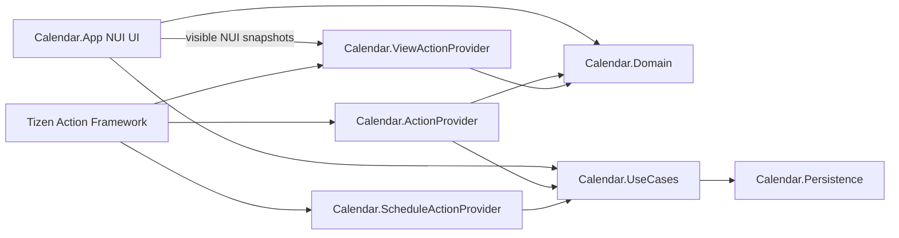

# Calendar Tizen Action Framework 2.0 개발 가이드

## 1. 목적과 대상

이 문서는 `Calendar` 예제 앱을 기준으로 Tizen Action Framework 2.0 domain app을 개발하는 절차를 설명합니다. 대상 독자는 다음과 같습니다.

- 앱이 소유한 domain Entity를 typed Action으로 제공하려는 application provider 개발자
- NUI 화면의 Entity를 ViewAnnotation으로 Agent에 노출하려는 개발자
- generated TIDL binding, manifest registration, Emulator E2E를 함께 검증해야 하는 개발자

platform catalog의 schema와 `action.seq`를 관리하는 작업은 일반 앱 provider 개발과 책임이 다릅니다. 해당 작업은 [상위 domain 개발 가이드](../../docs/TIZEN_ACTION_DOMAIN_DEVELOPMENT_GUIDE.md)를 함께 확인하십시오.

## 2. Calendar의 전체 구조



핵심 원칙은 UI와 provider가 동일한 app-owned repository/use-case를 공유하는 것입니다. UI가 자기 자신의 Action RPC를 호출하지 않습니다.

`CalendarApplication.OnCreate()`는 동일 repository와 command service를 구성한 뒤 다음 provider host를 시작합니다.

- `CalendarActionProviderHost`
- `ScheduleReminderActionProviderHost`
- `CalendarViewActionProviderHost`

## 3. Entity와 Action 계약

### 3.1 Calendar Entity

Calendar event의 stable identity는 `CalendarEvent.Id`이며 wire Entity type은 다음과 같습니다.

```text
Tizen.Entity.Calendar
```

주요 wire 필드:

```text
Id
Title
StartDate
EndDate
Note
Location
```

provider는 domain model을 generated `TizenEntityCalendar`로 변환합니다. ViewAnnotation의 `EntityInfo`도 같은 generated DTO의 `ToJson()`을 사용합니다. Entity JSON을 별도로 손으로 조립하지 마십시오.

### 3.2 제공하는 Calendar Actions

manifest에 등록된 Calendar Actions:

```text
Tv_Tizen.Action.Calendar_GetEventByIds
Tv_Tizen.Action.Calendar_AddEvent
Tv_Tizen.Action.Calendar_UpdateEvent
Tv_Tizen.Action.Calendar_RemoveEvent
Tv_Tizen.Action.Calendar_Search
Tv_Tizen.Action.Calendar_SearchInPeriod
Tv_Tizen.Action.Calendar_ToPresentation
```

`Calendar_Search(Tizen.Entity.Query)`는 기존 ABI를 유지하는 broad keyword 검색입니다. 고급 검색은 별도 typed query를 사용하는 `Calendar_SearchInPeriod`로 추가되었습니다.

### 3.3 typed 고급 검색

`Tizen.Entity.CalendarSearchQuery`는 다음 의미를 사용합니다.

- `Keyword`: 검색어
- `StartDate`: optional ISO 8601 timestamp, explicit offset 필수
- `EndDate`: optional ISO 8601 timestamp, explicit offset 필수
- `SearchTitle`: 제목 검색
- `SearchLocation`: 장소 검색
- `SearchNote`: 메모 검색
- `Number`: bounded result limit

기간 overlap은 모든 계층에서 다음과 같습니다.

```text
[StartInclusive, EndExclusive)

event.End > StartInclusive
AND
event.Start < EndExclusive
```

현재 generated optional boolean은 omitted와 explicit `false`를 구분하지 못합니다. 따라서 selector가 모두 `false`이면 호환성 기본값으로 Title/Location/Note 전체를 검색합니다. 하나 이상 `true`이면 선택된 필드만 검색합니다.

날짜-only UI 값은 UTC 자정으로 강제하지 않습니다. `CalendarDateBoundary`가 app의 local timezone을 사용해 날짜 경계를 `DateTimeOffset`으로 변환하며 DST invalid/ambiguous local time을 처리합니다.

## 4. schema와 generated binding 관리

### 4.1 절대 수정하지 않을 것

다음 source는 generated output이므로 수동 수정하지 않습니다.

```text
src/Calendar.ActionProvider/Generated/CalendarActionProvider.cs
src/Calendar.ScheduleActionProvider/Generated/ScheduleReminderActionProvider.cs
src/Calendar.ViewActionProvider/Generated/CalendarViewActionProvider.cs
```

API 변경이 필요하면 authoritative Entity/Action schema와 generator 입력을 수정하고 다시 생성합니다.

### 4.2 append-only ABI

TIDL method ID는 category 내 `action.seq` 위치에 의존합니다.

- 기존 Action을 reorder하지 않습니다.
- 새 Action은 기존 category section 끝에 append합니다.
- provider가 일부 Action만 구현하더라도 binding은 category 전체를 생성합니다.
- live/baseline 생성물의 기존 `MethodId`를 비교해 ABI를 확인합니다.

### 4.3 binding 생성

환경 예:

```bash
export ACTIONC_ACTION2TIDL="$(command -v action2tidl)"
export ACTIONC_TIDLC="$(command -v tidlc)"
: "${TIZEN_ACTION_ROOT:?Set TIZEN_ACTION_ROOT to the tizen-action repository}"
export DEFAULT_ACTIONS="$TIZEN_ACTION_ROOT/default-actions"
```

Calendar category:

```bash
actionc \
  -a Tizen.Action.Calendar \
  -d "$DEFAULT_ACTIONS" \
  -l 'C#' \
  -o src/Calendar.ActionProvider/Generated/CalendarActionProvider
```

Schedule category:

```bash
actionc \
  -a Tizen.Action.Schedule \
  -d "$DEFAULT_ACTIONS" \
  -l 'C#' \
  -o src/Calendar.ScheduleActionProvider/Generated/ScheduleReminderActionProvider
```

View category:

```bash
actionc \
  -a Tizen.Internal.Action.View \
  -d "$DEFAULT_ACTIONS" \
  -l 'C#' \
  -o src/Calendar.ViewActionProvider/Generated/CalendarViewActionProvider
```

`-o`는 extensionless basename입니다. `.cs`를 붙이면 `*.cs.cs`가 생성될 수 있습니다. 생성 후 임시 출력과 repository 파일을 byte-compare하고 provider project를 compile하십시오.

## 5. provider 구현

### 5.1 service와 host 분리

각 provider는 두 역할로 분리합니다.

- `*Service`: generated `ServiceBase` method 구현
- `*ProviderHost`: stub 생성, `Listen(...)`, app-owned dependency 연결

Calendar 예:

```text
CalendarActionProviderHost.Start(repository, commands)
  -> CalendarProviderState.Configure(...)
  -> TizenActionCalendar.Listen(typeof(CalendarService))
```

generated DTO는 provider boundary에서만 사용합니다. Domain/Persistence/UseCases는 Tizen-free 상태를 유지합니다.

### 5.2 manifest registration

구현한 각 exact Action name을 `tizen-manifest.xml`에 등록합니다.

```xml
<metadata
  key="http://tizen.org/metadata/action/provider"
  value="Tv_Tizen.Action.Calendar_SearchInPeriod" />
```

category 전체 binding을 생성하더라도 앱이 실제로 제공하지 않는 Action까지 manifest에 광고하면 안 됩니다. manifest registration, provider `Listen`, actual method implementation이 모두 있어야 합니다.

Calendar 앱은 provider 연결과 launch에 필요한 다음 privilege도 선언합니다.

```text
http://tizen.org/privilege/datasharing
http://tizen.org/privilege/appmanager.launch
```

alarm/reminder 기능은 별도 alarm/notification privilege를 사용합니다.

## 6. ViewAnnotation 통합

Calendar는 현재 화면에 실제로 렌더된 event card만 annotation으로 게시합니다.

```text
View ID:     calendar:event:<CalendarEvent.Id>
View Type:   Calendar.EventCard
EntityType:  Tizen.Entity.Calendar
EntityId:    CalendarEvent.Id
EntityInfo:  generated TizenEntityCalendar.ToJson()
```

헤더, Command Bar, view tab, search input은 Calendar Entity annotation 대상이 아닙니다.

### 6.1 좌표 포함 여부

좌표는 포함됩니다. 다만 `Annotation` 객체 내부가 아니라 그것을 감싸는
`Tizen.Entity.View.ScreenBounds`와 `WindowBounds`에 있습니다.

```json
{
  "Id": "calendar:event:event-001",
  "ScreenBounds": {
    "X": 384.0,
    "Y": 144.0,
    "Width": 700.0,
    "Height": 64.0
  },
  "WindowBounds": {
    "X": 384.0,
    "Y": 144.0,
    "Width": 700.0,
    "Height": 64.0
  },
  "Annotation": {
    "EntityType": "Tizen.Entity.Calendar",
    "EntityId": "event-001",
    "EntityInfo": "{...generated entity JSON...}"
  }
}
```

`CalendarApplication`은 event NUI view에서 `CalculateScreenPositionSize()`를 호출해 screen-space X/Y/Width/Height를 수집합니다. `Window.Default.WindowPosition`을 빼 window-relative X/Y도 계산합니다. width/height fallback은 실제 `View.Size`를 사용합니다. finite screen bounds이고 Width/Height가 양수인 snapshot만 게시되며 synthetic zero bounds는 게시하지 않습니다. window 위치를 읽을 수 없는 frame에서는 `WindowBounds`를 생략하되 유효한 `ScreenBounds`는 계속 게시합니다.

좌표·focus·lifecycle의 상세 계약은 [ViewAnnotation 및 좌표 계약](VIEW_ANNOTATION.md)을 참조하십시오.

### 6.2 actual focus

focused annotation은 logical index로 추정하지 않습니다.

1. `FocusManager.Instance.GetCurrentFocusView()`로 실제 NUI focus를 읽습니다.
2. focused view가 active surface subtree에 속하는지 검사합니다.
3. view name이 `CalendarEvent-<id>`일 때만 focused Entity ID를 게시합니다.
4. `FocusChanged` 이벤트에서 기존 visible snapshot의 focus 상태를 다시 게시합니다.

pause/terminate 시 published view snapshot을 비우며 resume/render 후 다시 수집합니다.

### 6.3 View Actions와 A2UI

manifest에 등록된 View Actions:

```text
Common_Tizen.Internal.Action.View_FindById
Common_Tizen.Internal.Action.View_GetAnnotatedViews
Common_Tizen.Internal.Action.View_GetFocusedView
Common_Tizen.Internal.Action.View_ToPresentation
```

`ToPresentation`은 Annotation의 generated Calendar Entity JSON에서 presentation을 만들며 다음 A2UI message를 반환합니다.

- `Template`: `surfaceUpdate`
- `Document`: matching `dataModelUpdate`

## 7. UI와 semantic command

TV D-pad, Enter, pointer는 동일한 `CalendarUiCommand` reducer path를 사용합니다. pointer가 event 또는 command control을 활성화할 때 해당 NUI view에도 actual focus를 설정합니다.

Command Bar 순서:

```text
Previous → Today → Next → period title → Month → Week → Day → Agenda → Search
```

period event focus는 array index가 아니라 stable `FocusedEventId`를 사용합니다. D-pad 대상 목록은 repository 전체가 아니라 실제 renderer limit과 일치하는 event ID 목록입니다.

## 8. host 검증

repository root `Calendar/`에서 실행합니다.

```bash
set -euo pipefail

dotnet run --project tests/Calendar.Domain.Tests/Calendar.Domain.Tests.csproj
dotnet run --project tests/Calendar.Persistence.Tests/Calendar.Persistence.Tests.csproj
dotnet run --project tests/Calendar.UseCases.Tests/Calendar.UseCases.Tests.csproj
dotnet run --project tests/Calendar.App.Tests/Calendar.App.Tests.csproj
dotnet run --project tests/Calendar.ActionProvider.Tests/Calendar.ActionProvider.Tests.csproj

dotnet build src/Calendar.ActionProvider/Calendar.ActionProvider.csproj --configuration Debug --no-restore
dotnet build src/Calendar.ScheduleActionProvider/Calendar.ScheduleActionProvider.csproj --configuration Debug --no-restore
dotnet build src/Calendar.ViewActionProvider/Calendar.ViewActionProvider.csproj --configuration Debug --no-restore
dotnet build src/Calendar.App/Calendar.App.csproj --configuration Debug --no-restore

git diff --check
```

`Calendar.ActionProvider.Tests`는 Tizen-independent `CalendarSearchQueryAdapter`와 repository semantics를 host에서 실행합니다. generated Tizen service routing 자체는 provider compile과 target RPC E2E로 검증합니다.

## 9. TPK packaging

Public Common Emulator용 generic package는 custom signing profile을 지정하지 않습니다.

```bash
set -euo pipefail

dotnet build src/Calendar.App/Calendar.App.csproj --configuration Debug --no-restore

OUT="$PWD/src/Calendar.App/bin/Debug/net8.0"
STAGE="$(mktemp -d /tmp/calendar-stage.XXXXXX)"
PACKAGE_OUTPUT="$(mktemp -d /tmp/calendar-package.XXXXXX)"

python3 - "$OUT" "$STAGE" <<'PY'
import os
import shutil
import sys

source, destination = sys.argv[1:]
for name in os.listdir(source):
    path = os.path.join(source, name)
    if os.path.isfile(path):
        shutil.copy2(path, os.path.join(destination, name))
PY

cp src/Calendar.App/tizen-manifest.xml "$STAGE/tizen-manifest.xml"
tizen package -t tpk -o "$PACKAGE_OUTPUT" -- "$STAGE"
```

`bin/Debug/net8.0`의 stale nested `packaging/` 디렉터리를 재귀 복사하지 않고 top-level regular file만 staging합니다.

packager가 `Calendar.App.dll`처럼 executable 이름으로 출력하더라도 ZIP-based signed TPK일 수 있습니다. archive를 확인한 뒤 `.tpk` 이름으로 복사합니다.

```bash
unzip -t "$PACKAGE_OUTPUT/Calendar.App.dll"
unzip -Z1 "$PACKAGE_OUTPUT/Calendar.App.dll"
mkdir -p dist
cp "$PACKAGE_OUTPUT/Calendar.App.dll" \
  dist/org.tizen.actionexamples.calendar-0.1.0.tpk
sha256sum dist/org.tizen.actionexamples.calendar-0.1.0.tpk
```

필수 payload에는 manifest, signature, app DLL, project-reference DLL이 모두 있어야 합니다. default signer warning은 Emulator test 전용 signature라는 뜻이며 production distribution 증거가 아닙니다.

## 10. Common Emulator E2E

### 10.1 install과 launch

```bash
: "${SERIAL:?Set SERIAL to the target device serial}"
PACKAGE=dist/org.tizen.actionexamples.calendar-0.1.0.tpk
APPID=org.tizen.actionexamples.calendar

sdb devices
sdb -s "$SERIAL" install "$PACKAGE"
sdb -s "$SERIAL" shell "app_launcher -s $APPID"
sdb -s "$SERIAL" shell "app_launcher --is-running $APPID"
```

raw DLL을 설치하지 말고 TPK를 설치합니다.

### 10.2 provider discovery

```bash
sdb -s "$SERIAL" shell \
  'action-tool find-appids Tizen.Action.Calendar --json'

sdb -s "$SERIAL" shell \
  'action-tool get-action Tv_Tizen.Action.Calendar_SearchInPeriod --json'
```

TPK install 성공만으로 provider routing 성공을 결론 내리지 않습니다. 실제 app ID discovery와 explicit `appid` invocation을 확인합니다.

platform/default-actions RPM을 갱신한 경우 payload install 후 Action DB manifest preload가 별도로 필요할 수 있습니다.

```bash
sdb -s "$SERIAL" shell \
  'unified-backend --preload -y org.tizen.action-framework.default-actions'
```

### 10.3 runtime acceptance

Calendar Actions:

```text
Add → GetEventByIds → Search/SearchInPeriod → Update → ToPresentation → Remove
```

각 Action마다 다음을 남깁니다.

- positive typed result
- validation/negative case
- repository/UI postcondition
- restart persistence가 관련되면 restart 후 postcondition

View Actions:

```text
launch visible event
  → GetAnnotatedViews
  → FindById
  → actual NUI focus 이동
  → GetFocusedView
  → ToPresentation
  → background/pause에서 empty
  → foreground/resume에서 republish
```

반환 payload에서 다음을 확인합니다.

- stable view ID와 Entity ID
- finite positive `ScreenBounds`와 가능한 경우 `WindowBounds`
- generated `EntityInfo`
- actual `IsFocused`
- A2UI Template/Document가 각각 valid JSON

## 11. 변경 체크리스트

### Entity/Action

- [ ] stable ID와 data ownership을 정의했다.
- [ ] 기존 Action ABI를 수정하지 않았다.
- [ ] 새 method를 category 끝에 append했다.
- [ ] whole-category generated binding을 재생성했다.
- [ ] generated source를 수동 수정하지 않았다.
- [ ] manifest에 실제 구현 Action만 등록했다.

### Domain/provider

- [ ] UI와 provider가 같은 query/command service를 공유한다.
- [ ] generated DTO는 provider boundary에만 있다.
- [ ] timestamp offset, period boundary, limit을 검증한다.
- [ ] provider host test와 target RPC test를 분리했다.

### ViewAnnotation

- [ ] 실제 렌더된 Entity view만 게시한다.
- [ ] `EntityInfo`는 generated Entity `ToJson()`이다.
- [ ] `ScreenBounds`와 `WindowBounds`는 finite이고 Width/Height가 양수다.
- [ ] focused state는 actual NUI focus에서 계산한다.
- [ ] pause/terminate에서 snapshot을 clear한다.
- [ ] `ToPresentation`이 성공하는 A2UI payload를 반환한다.

### Packaging/E2E

- [ ] host tests와 builds가 통과한다.
- [ ] archive manifest/signature/dependency를 검사했다.
- [ ] TPK install, launch, running을 각각 확인했다.
- [ ] provider discovery와 explicit invocation을 확인했다.
- [ ] UI D-pad/pointer/focus와 View Action lifecycle을 실제 화면에서 확인했다.
