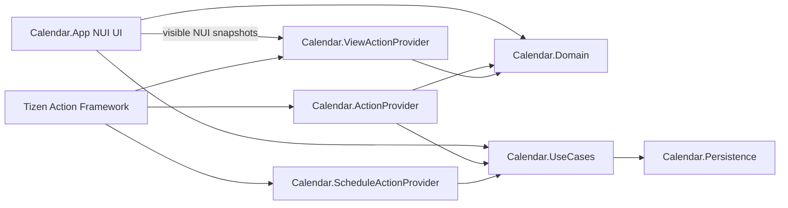

# Calendar Tizen Action Framework 2.0 개발 가이드

## 1. 목적과 대상

이 문서는 `Calendar` 예제 앱을 기준으로 Tizen Action Framework 2.0 domain app을 개발하는 절차를 설명합니다. 대상 독자는 다음과 같습니다.

- 앱이 소유한 domain Entity를 typed Action으로 제공하려는 application provider 개발자
- NUI 화면의 Entity를 ViewAnnotation으로 Agent에 노출하려는 개발자
- generated TIDL binding, manifest registration, Emulator E2E를 함께 검증해야 하는 개발자

platform catalog의 schema와 `action.seq`를 관리하는 작업은 일반 앱 provider 개발과 책임이 다릅니다. 해당 작업은 [상위 domain 개발 가이드](../../docs/TIZEN_ACTION_DOMAIN_DEVELOPMENT_GUIDE.md)를 함께 확인하십시오.

## 2. Calendar의 전체 구조



핵심 원칙은 UI와 provider가 동일한 app-owned repository/use-case를 공유하는 것입니다. UI가 자기 자신의 Action RPC를 호출하지 않습니다.

`CalendarApplication.OnCreate()`는 동일 repository와 command service를 구성한 뒤 다음 provider host를 시작합니다.

- `CalendarActionProviderHost`
- `ScheduleReminderActionProviderHost`
- `CalendarViewActionProviderHost`

## 3. 현재 Entity와 Action 계약

2026-09-06 기준 source는 `~/samba/workspace/appfw/tizen-action/default-actions`입니다.
이전 Calendar/Query ABI를 유지하지 않습니다. consumer도 현재 catalog로 재생성해야 합니다.
자세한 이전/이후 대응은 [변경 기록](2026-09-06-dotnet-update.md)에 있습니다.

| Category | Methods | Entity / 입력 |
|---|---|---|
| `Tizen.Action.Calendar` | AddEvent, DeleteEvent, UpdateEvent, Search, ToPresentation | `CalendarEvent`, `CalendarQuery`, ToPresentation은 event 배열 |
| `Tizen.Action.Reminder` | Add, Delete, Update, Search, ToPresentation | `Reminder`, `Query`, `ReminderState` |
| `Tizen.Action.CalendarCustom` | GetEventByIds, SearchInPeriod | IDs 배열, `Calendar.Entity.SearchQuery` |
| `Tizen.Action.View` | FindById, GetAnnotatedViews, GetFocusedView, ToPresentation | `View`, `Annotation` |

표준 category는 `action.seq` 전체 순서로 생성합니다. 위 표의 나열 순서를 method ID로 사용하지 마십시오.
`Calendar.ScheduleActionProvider`는 project 이름만 유지하며 표준 Reminder category를 구현합니다.

- CalendarQuery는 `Id`, `Category`, `Keyword`, `Limit`, `StartDate`, `EndDate`를 지원합니다.
- Id 조건을 limit보다 먼저 적용합니다. Limit 기본값 20, 최댓값 100입니다.
- 날짜는 explicit offset을 가진 ISO 8601, 범위는 `[StartInclusive, EndExclusive)`입니다.
- overlap: `event.End > StartInclusive && event.Start < EndExclusive`.
- Custom SearchQuery는 CalendarQuery를 상속하고 `SearchTitle`, `SearchLocation`, `SearchNote`를 추가합니다. 모두 false이면 전체 필드를 검색합니다.
- 표준 Id 검색은 단일 항목을 찾을 수 있습니다. Custom batch resolver는 요청 순서·중복·명시적인 unresolved IDs를 보존합니다(최대 100개, 각 ID 256자).
- Reminder는 `State.State`의 `To-do`, `In-progress`, `Blocked`, `Done`을 보존합니다. 이전 bool completion JSON도 계속 읽습니다.
- Calendar event presentation은 배열 0–100개를 지원합니다. 한 항목은 View 경로와 같은 event presentation builder를 사용합니다.

## 4. schema와 generated binding

.NET reference는 `Tizen.NET 14.0.0.19326`, app manifest의 dotnet API는 14입니다.
로컬 TizenFX source는 `~/tizen/platform/core/csapi/tizenfx`입니다.
API 14의 `HasPrivilegeLocal`을 사용하는 최신 생성물을 그대로 빌드하며,
RPCPort 구현이나 generated C#의 privilege 경로를 직접 수정하지 않습니다.

Calendar 디렉터리에서:

```bash
./build.sh generate
./build.sh build
# 또는 생성과 빌드
./build.sh all
python3 tests/check_action_contracts.py
```

`generate-bindings.py`는 표준 Calendar/Reminder/View 전체 category와 앱 소유 CalendarCustom을 생성합니다.
`ACTIONC_BIN`, `ACTIONC_DATA_DIR`, `CONFIGURATION`으로 도구·catalog·구성을 지정할 수 있습니다.
표준 schema와 `action.seq`는 수정하지 않습니다. Custom의 기존 두 method 순서는 고정하고 이후 확장은 뒤에 추가합니다.
`--output-root`로 임시 디렉터리에 생성하여 repository 출력과 byte-compare할 수 있습니다.

## 5. provider와 manifest

UI와 provider는 같은 repository/command instance를 사용합니다.
Service는 입력 검증, generated DTO 변환, use-case 실행, `Status.Success/Reason` 반환을 담당합니다.
`FindById` 등 현재 화면 조회는 공유 snapshot store를 사용하며 UI thread로 RPC를 재진입하지 않습니다.

표준 provider metadata 14개와 Custom provider 2개를 등록합니다.
Custom 정의에는 `http://tizen.org/metadata/action`, Entity 정의에는 `/action/entity` metadata도 필요합니다.
패키지의 `res/`에는 아래 source와 동일한 정의가 들어갑니다.

```text
actions/App_Tizen.Action.CalendarCustom_GetEventByIds.action
actions/App_Tizen.Action.CalendarCustom_SearchInPeriod.action
entities/Calendar.Entity.SearchQuery.entity
```

## 6. ViewAnnotation

현재 페이지, 렌더된 일정·리마인더, 검색/편집/명령 컨트롤을 공개합니다.
빈 페이지도 페이지 context를 가지며 overlay에서는 가려진 Calendar 배경을 공개하지 않습니다.
`GetFocusedView`는 실제 NUI focus 및 TextField/TextEditor의 key input focus를 확인합니다.
`FindById`는 현재 게시 목록만 조회합니다. 전환·pause·제거 시 이전 목록은 폐기합니다.

- 일정: generated `TizenEntityCalendarEvent.ToJson()`.
- 리마인더: generated `TizenEntityReminder.ToJson()`.
- 페이지·컨트롤: generated `TizenEntity.ToJson()`, `Extra`에 version 1 페이지/입력 상태.
- 좌표: `CalculateScreenPositionSize()`의 finite positive bounds만 사용합니다. reference `View.Size` fallback은 없습니다.
- WindowBounds는 screen 좌표에서 `Window.Default.WindowPosition`을 뺀 값입니다.
- `View_ToPresentation`은 EntityId 일치와 JSON 크기/형식을 검증합니다. 기존 legacy v0.8 `surfaceUpdate`/`dataModelUpdate` profile이며 canonical v0.9.1 지원 주장이 아닙니다.

[페이지별 계약 및 target 검증 절차](VIEW_ANNOTATION.md)를 참고하십시오.

## 7. UI와 semantic command

TV D-pad, Enter, pointer는 동일한 `CalendarUiCommand` reducer path를 사용합니다. pointer가 event 또는 command control을 활성화할 때 해당 NUI view에도 actual focus를 설정합니다.

Command Bar 순서:

```text
Previous → Today → Next → period title → Month → Week → Day → Agenda → Search
```

period event focus는 array index가 아니라 stable `FocusedEventId`를 사용합니다. D-pad 대상 목록은 repository 전체가 아니라 실제 renderer limit과 일치하는 event ID 목록입니다.

## 8. host 검증

repository root `Calendar/`에서 실행합니다.

```bash
set -euo pipefail

dotnet run --project tests/Calendar.Domain.Tests/Calendar.Domain.Tests.csproj
dotnet run --project tests/Calendar.Persistence.Tests/Calendar.Persistence.Tests.csproj
dotnet run --project tests/Calendar.UseCases.Tests/Calendar.UseCases.Tests.csproj
dotnet run --project tests/Calendar.App.Tests/Calendar.App.Tests.csproj
dotnet run --project tests/Calendar.ActionProvider.Tests/Calendar.ActionProvider.Tests.csproj

dotnet build src/Calendar.ActionProvider/Calendar.ActionProvider.csproj --configuration Debug --no-restore
dotnet build src/Calendar.ScheduleActionProvider/Calendar.ScheduleActionProvider.csproj --configuration Debug --no-restore
dotnet build src/Calendar.ViewActionProvider/Calendar.ViewActionProvider.csproj --configuration Debug --no-restore
dotnet build src/Calendar.App/Calendar.App.csproj --configuration Debug --no-restore

git diff --check
```

`Calendar.ActionProvider.Tests`는 Tizen-independent `CalendarSearchQueryAdapter`와 repository semantics를 host에서 실행합니다. generated Tizen service routing 자체는 provider compile과 target RPC E2E로 검증합니다.

## 9. TPK packaging

```bash
./package.sh
unzip -t dist/org.tizen.calendar-0.1.0-api14.tpk
```

`package.sh`는 `tizen build-cs`로 build.info를 생성하고, 앱과 의존 DLL·manifest·res를 임시 stage에 배치합니다.
Tizen CLI가 stage의 resource를 찾도록 stage의 build.info project-path도 맞춥니다.
Common Emulator 시험용 서명 후 ZIP 구조, manifest, 두 signature, Custom 정의의 원문 일치를 검사합니다.
이 작업은 target에 설치하지 않습니다. TV/product 서명 및 실행은 별도 검증입니다.

## 10. Common Emulator E2E

### 10.1 install과 launch

```bash
: "${SERIAL:?Set SERIAL to the target device serial}"
PACKAGE=dist/org.tizen.calendar-0.1.0-api14.tpk
APPID=org.tizen.calendar

sdb devices
sdb -s "$SERIAL" install "$PACKAGE"
sdb -s "$SERIAL" shell "app_launcher -s $APPID"
sdb -s "$SERIAL" shell "app_launcher --is-running $APPID"
```

raw DLL을 설치하지 말고 TPK를 설치합니다.

### 10.2 provider discovery

```bash
sdb -s "$SERIAL" shell \
  'action-tool find-appids Tizen.Action.Calendar --json'

sdb -s "$SERIAL" shell \
  'action-tool get-action App_Tizen.Action.CalendarCustom_SearchInPeriod --json'
```

TPK install 성공만으로 provider routing 성공을 결론 내리지 않습니다. 실제 app ID discovery와 explicit `appid` invocation을 확인합니다.

### 10.3 runtime acceptance

Calendar Actions:

```text
AddEvent → Custom_GetEventByIds → Search/Custom_SearchInPeriod → UpdateEvent → ToPresentation → DeleteEvent → Search(Id)
```

각 Action마다 다음을 남깁니다.

- positive typed result
- validation/negative case
- repository/UI postcondition
- restart persistence가 관련되면 restart 후 postcondition

View Actions:

```text
launch visible event
  → GetAnnotatedViews
  → FindById
  → actual NUI focus 이동
  → GetFocusedView
  → ToPresentation
  → background/pause에서 empty
  → foreground/resume에서 republish
```

반환 payload에서 다음을 확인합니다.

- stable view ID와 Entity ID
- finite positive `ScreenBounds`와 가능한 경우 `WindowBounds`
- generated `EntityInfo`
- actual `IsFocused`
- A2UI Template/Document가 각각 valid JSON

## 11. 변경 체크리스트

### Entity/Action

- [ ] stable ID와 data ownership을 정의했다.
- [ ] consumer도 현재 catalog ABI로 생성했다.
- [ ] 표준 catalog를 수정하지 않고 필요한 앱 확장을 Custom으로 생성했다.
- [ ] whole-category generated binding을 재생성했다.
- [ ] generated source를 수동 수정하지 않았다.
- [ ] manifest에 실제 구현 Action만 등록했다.

### Domain/provider

- [ ] UI와 provider가 같은 query/command service를 공유한다.
- [ ] generated DTO는 provider boundary에만 있다.
- [ ] timestamp offset, period boundary, limit을 검증한다.
- [ ] provider host test와 target RPC test를 분리했다.

### ViewAnnotation

- [ ] 현재 페이지·컨트롤·렌더된 Entity view만 게시한다.
- [ ] `EntityInfo`는 generated Entity `ToJson()`이다.
- [ ] `ScreenBounds`와 `WindowBounds`는 finite이고 Width/Height가 양수다.
- [ ] focused state는 actual NUI focus에서 계산한다.
- [ ] pause/terminate에서 snapshot을 clear한다.
- [ ] `ToPresentation`이 성공하는 A2UI payload를 반환한다.

### Packaging/E2E

- [ ] host tests와 builds가 통과한다.
- [ ] archive manifest/signature/dependency를 검사했다.
- [ ] TPK install, launch, running을 각각 확인했다.
- [ ] provider discovery와 explicit invocation을 확인했다.
- [ ] UI D-pad/pointer/focus와 View Action lifecycle을 실제 화면에서 확인했다.

2026-09-06 검증: Calendar 5개 host suite와 Reminder 2개 suite, 두 앱 Release build를 통과했습니다. 이번 패키지의 target 설치·Action 호출·Aurum 검증은 미수행입니다. 기존 screenshot/E2E 기록을 이번 변경의 증거로 사용하지 않습니다.
