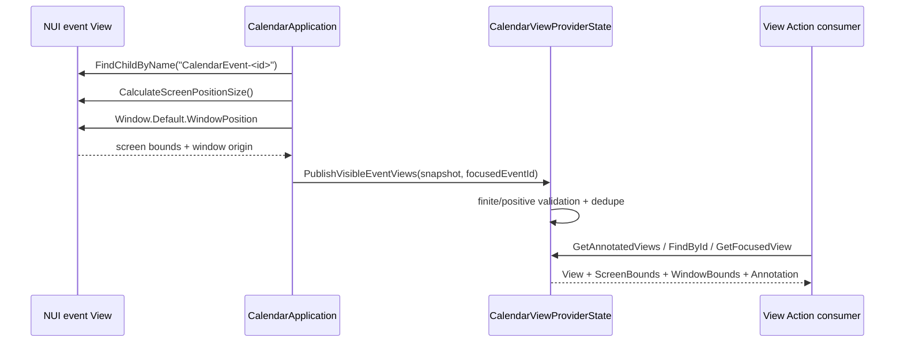

# Calendar ViewAnnotation 및 좌표 계약

## 1. 새 `Tizen.Entity.View` 계약

Calendar는 업데이트된 `Tizen.Entity.View` schema를 사용합니다.

- `ScreenBounds`: screen-space geometry
- `WindowBounds`: owning window 기준 geometry
- `Annotation.EntityType`: generated Entity type
- `Annotation.EntityId`: stable Entity ID
- `Annotation.EntityInfo`: generated Entity `ToJson()` 결과

이전 schema의 `Bounds`, `IsVisible`, `HasAnnotation`,
`Annotation.EntityJson`은 더 이상 게시하지 않습니다. Annotation 존재 여부는
`Annotation` 값 자체로 판단합니다.

## 2. wire 구조

개념적인 반환 예:

```json
{
  "Id": "calendar:event:e2e-commandbar-001",
  "Type": "Calendar.EventCard",
  "Description": "Calendar E2E Review",
  "ScreenBounds": {
    "X": 384.0,
    "Y": 144.0,
    "Width": 700.0,
    "Height": 64.0
  },
  "WindowBounds": {
    "X": 384.0,
    "Y": 144.0,
    "Width": 700.0,
    "Height": 64.0
  },
  "IsFocused": false,
  "IsEnabled": true,
  "Annotation": {
    "EntityType": "Tizen.Entity.Calendar",
    "EntityId": "e2e-commandbar-001",
    "EntityInfo": "{\"TizenEntityCalendar\":{...}}"
  }
}
```

`EntityInfo`는 JSON-in-a-string이며 generated
`TizenEntityCalendar.ToJson()` 결과입니다. Consumer는 outer View JSON과
inner Entity JSON을 각각 parse합니다.

## 3. source data flow



주요 source:

- `src/Calendar.App/CalendarApplication.cs`
  - active surface의 `CalendarEvent-<id>` NUI view 검색
  - `CalculateScreenPositionSize()`로 screen bounds 수집
  - `Window.Default.WindowPosition`으로 window origin 수집
  - actual focused event ID 계산
- `src/Calendar.ViewActionProvider/CalendarViewActionProviderHost.cs`
  - screen/window 좌표를 가진 `CalendarEventViewSnapshot` 전달
- `src/Calendar.ViewActionProvider/CalendarViewService.cs`
  - finite/positive screen bounds 필터
  - `ScreenBounds`와 가능한 경우 `WindowBounds` 구성
  - generated Calendar Entity `ToJson()`을 `EntityInfo`로 게시

## 4. 게시 조건

Calendar는 다음 조건을 모두 만족하는 event card만 게시합니다.

1. 현재 active surface에 실제 NUI view가 존재합니다.
2. stable name은 `CalendarEvent-<CalendarEvent.Id>`입니다.
3. screen X/Y/Width/Height가 finite입니다.
4. Width와 Height가 0보다 큽니다.
5. 동일 Entity ID snapshot은 중복 게시하지 않습니다.

사용할 수 없는 geometry를 synthetic `(0, 0, 0, 0)`으로 대체하지 않습니다.
window origin을 읽지 못한 frame에서는 `WindowBounds`만 생략하고, 유효한
`ScreenBounds`와 annotation은 계속 게시합니다.

## 5. 좌표의 의미

### ScreenBounds

`CalculateScreenPositionSize()`에서 수집한 실제 NUI screen-space snapshot입니다.

- `X`, `Y`: screen 기준 event view 위치
- `Width`, `Height`: 현재 렌더 크기

### WindowBounds

같은 snapshot에서 window origin을 빼 계산합니다.

```text
WindowBounds.X = ScreenBounds.X - Window.Default.WindowPosition.X
WindowBounds.Y = ScreenBounds.Y - Window.Default.WindowPosition.Y
```

크기는 screen bounds와 같습니다. 두 좌표계 모두 publication 시점의 값이므로
layout, view mode, window 위치와 크기, 화면 전환 후에는 다시 조회해야 합니다.

## 6. focus 계약

`IsFocused`는 logical reducer state만으로 만들지 않습니다.

1. `FocusManager.Instance.GetCurrentFocusView()`로 실제 NUI focus를 읽습니다.
2. focused view가 현재 active surface subtree 내부인지 확인합니다.
3. name prefix가 `CalendarEvent-`인 경우에만 event ID를 추출합니다.
4. `FocusChanged`에서 geometry snapshot을 focus 상태와 함께 재게시합니다.

Command Bar, search input, overlay root 등 non-Entity control에 focus가 있으면
`GetFocusedView`는 focused Calendar annotation이 없다는 failure를 반환할 수
있습니다.

## 7. surface와 lifecycle

게시 대상:

- Calendar Month/Week/Day/Agenda의 실제 렌더 event card
- Search result의 실제 렌더 event card
- Event detail에서 선택 event를 표현하는 active view

헤더, navigation, command, editor draft와 화면 밖 view는 게시하지 않습니다.
render와 focus 변경 후 snapshot을 게시하고, pause/terminate에서 clear하며,
resume 후 fresh geometry를 다시 수집합니다.

## 8. View Actions와 A2UI

Calendar 앱은 다음 exact View Actions를 등록합니다.

```text
Common_Tizen.Action.View_FindById
Common_Tizen.Action.View_GetAnnotatedViews
Common_Tizen.Action.View_GetFocusedView
Common_Tizen.Action.View_ToPresentation
```

- `GetAnnotatedViews`: 현재 visible annotated view 목록
- `FindById`: `calendar:event:<EntityId>`로 현재 view 조회
- `GetFocusedView`: actual focus를 가진 annotated Calendar view 조회
- `ToPresentation`: `Annotation.EntityInfo`의 generated Entity JSON을 A2UI로 변환

`ToPresentation`은 `Template`에 `surfaceUpdate`, `Document`에 matching
`dataModelUpdate` JSON을 반환합니다.

## 9. 검증 체크리스트

### Source/host

- [ ] snapshot에 screen/window 좌표와 size가 있습니다.
- [ ] provider가 non-finite screen 값과 non-positive size를 거부합니다.
- [ ] `ScreenBounds`가 measured screen snapshot과 일치합니다.
- [ ] `WindowBounds`가 screen 좌표에서 window origin을 뺀 값입니다.
- [ ] `EntityInfo`가 generated Entity `ToJson()` 결과입니다.
- [ ] actual NUI focus가 active surface subtree로 제한됩니다.

### Emulator

1. visible event를 만들고 `GetAnnotatedViews`를 호출합니다.
2. `ScreenBounds`와 `WindowBounds`가 finite positive인지 검사합니다.
3. View ID와 Entity ID가 stable event ID와 일치하는지 검사합니다.
4. event card로 actual focus를 이동합니다.
5. `GetFocusedView`가 동일 View/Entity ID를 반환하는지 검사합니다.
6. `FindById`로 같은 bounds와 `EntityInfo`를 조회합니다.
7. background에서 목록이 clear되고 foreground에서 republish되는지 확인합니다.
8. `ToPresentation`의 Template/Document를 각각 JSON parse합니다.

실제 숫자는 특정 frame의 증거이며 API 상수가 아닙니다. 완료 판단에는 현재
설치한 TPK의 RPC payload와 GUI automation screenshot을 함께 사용합니다.
