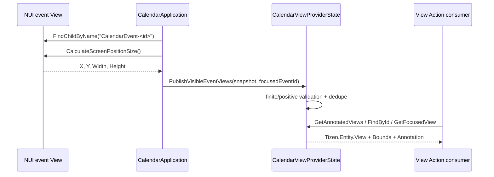

# Calendar ViewAnnotation 및 좌표 계약

## 1. 결론

현재 Calendar의 ViewAnnotation 결과에는 좌표 정보가 포함됩니다.

정확히는 Entity context인 `Annotation` 객체 내부가 아니라, annotation을 소유하는 `Tizen.Entity.View`의 `Bounds` 필드에 다음 값이 포함됩니다.

```text
Bounds.X
Bounds.Y
Bounds.Width
Bounds.Height
```

따라서 consumer는 한 `Tizen.Entity.View`에서 다음 두 부분을 함께 읽어야 합니다.

- `Bounds`: 화면 geometry
- `Annotation`: Entity type, stable ID, generated Entity JSON

## 2. wire 구조

개념적인 반환 예:

```json
{
  "Id": "calendar:event:e2e-commandbar-001",
  "Type": "Calendar.EventCard",
  "Description": "Calendar E2E Review",
  "Bounds": {
    "X": 384.0,
    "Y": 144.0,
    "Width": 700.0,
    "Height": 64.0
  },
  "IsFocused": false,
  "IsEnabled": true,
  "IsVisible": true,
  "HasAnnotation": true,
  "Annotation": {
    "EntityType": "Tizen.Entity.Calendar",
    "EntityId": "e2e-commandbar-001",
    "EntityJson": "{\"TizenEntityCalendar\":{...}}"
  }
}
```

`EntityJson`은 JSON-in-a-string이며 generated `TizenEntityCalendar.ToJson()` 결과입니다. outer View JSON parser와 별도로 inner Entity JSON을 parse해야 합니다.

## 3. source data flow



주요 source:

- `src/Calendar.App/CalendarApplication.cs`
  - active surface의 `CalendarEvent-<id>` NUI view 검색
  - `CalculateScreenPositionSize()` 호출
  - screen position과 size snapshot 생성
  - actual focused event ID 계산
- `src/Calendar.ViewActionProvider/CalendarViewActionProviderHost.cs`
  - `CalendarEventViewSnapshot(Event, X, Y, Width, Height)` 전달
- `src/Calendar.ViewActionProvider/CalendarViewService.cs`
  - finite/positive bounds 필터
  - `TizenEntityView.Bounds` 구성
  - generated Calendar Entity `ToJson()`으로 Annotation 구성

## 4. 게시 조건

Calendar는 다음 조건을 모두 만족하는 event card만 게시합니다.

1. 현재 active surface에 실제 NUI view가 존재한다.
2. stable name이 `CalendarEvent-<CalendarEvent.Id>`다.
3. X/Y/Width/Height가 finite다.
4. Width와 Height가 0보다 크다.
5. 동일 Entity ID snapshot은 중복 게시하지 않는다.

사용할 수 없는 geometry를 synthetic `(0, 0, 0, 0)`으로 대체하지 않습니다. frame 교체 중 actor handle 또는 bounds를 안정적으로 얻을 수 없으면 그 frame에서는 해당 view를 게시하지 않습니다.

## 5. 좌표의 의미

`CalculateScreenPositionSize()`에서 수집한 값이므로 Calendar가 사용하는 좌표는 실제 NUI screen-space snapshot입니다.

- `X`, `Y`: event view의 screen position
- `Width`, `Height`: event view의 현재 렌더 크기
- 값은 annotation publication 시점의 snapshot
- layout, view mode, window size, 화면 전환 후에는 바뀔 수 있음

Entity instance처럼 영구적으로 저장하거나 이전 frame 좌표를 재사용하면 안 됩니다. 최신 화면 상태는 `GetAnnotatedViews` 또는 `FindById`로 다시 조회합니다.

## 6. focus 계약

`IsFocused`는 logical reducer state만으로 만들지 않습니다.

1. `FocusManager.Instance.GetCurrentFocusView()`로 실제 NUI focus를 읽습니다.
2. focused view가 현재 active surface subtree 내부인지 확인합니다.
3. name prefix가 `CalendarEvent-`인 경우에만 event ID를 추출합니다.
4. `FocusChanged`에서 기존 visible geometry snapshot을 focus 상태와 함께 재게시합니다.

Command Bar, search input, overlay root 등 non-Entity control에 focus가 있으면 `GetFocusedView`는 focused Calendar annotation이 없다는 failure status를 반환할 수 있습니다.

## 7. surface와 lifecycle

게시 대상은 현재 surface에 따라 달라집니다.

- Calendar Month/Week/Day/Agenda: 실제 렌더된 event card
- Search results: 실제 렌더된 result card
- Event detail: 선택된 event를 표현하는 active view가 존재할 때 해당 view
- non-event controls: 미게시

lifecycle:

- render 후 snapshot publication
- NUI focus 변경 후 focus flag republish
- pause 시 clear
- terminate 시 clear 및 focus event unsubscribe
- resume/foreground render 후 fresh bounds republish

따라서 background 상태에서 stale coordinates를 계속 제공하지 않습니다.

## 8. View Actions

Calendar 앱은 다음 exact View Actions를 manifest에 등록합니다.

```text
Common_Tizen.Internal.Action.View_FindById
Common_Tizen.Internal.Action.View_GetAnnotatedViews
Common_Tizen.Internal.Action.View_GetFocusedView
Common_Tizen.Internal.Action.View_ToPresentation
```

동작:

- `GetAnnotatedViews`: 현재 visible annotated view 목록
- `FindById`: stable View ID로 현재 visible view 조회
- `GetFocusedView`: actual focus를 가진 annotated Calendar view 조회
- `ToPresentation`: Annotation의 generated Entity JSON을 A2UI로 변환

`FindById`의 ID는 Entity ID 자체가 아니라 다음 View ID입니다.

```text
calendar:event:<EntityId>
```

## 9. A2UI

`ToPresentation`은 ViewAnnotation의 generated `EntityJson`을 입력으로 사용합니다.

- `Template`: `surfaceUpdate` JSON
- `Document`: matching `dataModelUpdate` JSON

이 경로는 annotation context와 Agent presentation이 서로 다른 Entity serialization을 사용하지 않게 합니다.

## 10. 검증 체크리스트

### Source/host

- [ ] `CalendarEventViewSnapshot`에 X/Y/Width/Height가 있다.
- [ ] provider가 non-finite 값과 non-positive size를 거부한다.
- [ ] `Bounds`가 snapshot 값으로 구성된다.
- [ ] `EntityJson`이 generated `ToJson()` 결과다.
- [ ] actual NUI focus가 active surface subtree로 제한된다.

### Emulator

1. visible event를 만든다.
2. `GetAnnotatedViews`를 호출한다.
3. 반환 View의 `Bounds`가 finite positive인지 검사한다.
4. View ID와 Entity ID가 stable event ID와 일치하는지 검사한다.
5. event card로 actual focus를 이동한다.
6. `GetFocusedView`가 동일 View/Entity ID를 반환하는지 검사한다.
7. `FindById`로 같은 bounds/context를 조회한다.
8. background 전환 후 목록이 비는지 확인한다.
9. foreground 복귀 후 새 bounds가 게시되는지 확인한다.
10. `ToPresentation`의 Template/Document를 각각 JSON parse한다.

## 11. 실제 검증된 반환 형태

Common Emulator E2E에서 확인한 예:

```json
{
  "Id": "calendar:event:e2e-commandbar-001",
  "Bounds": {
    "X": 384.0,
    "Y": 144.0,
    "Width": 700.0,
    "Height": 64.0
  },
  "Annotation": {
    "EntityType": "Tizen.Entity.Calendar",
    "EntityId": "e2e-commandbar-001"
  }
}
```

이 숫자는 특정 Agenda layout/frame의 예시이며 API 상수가 아닙니다. 다른 view mode, window size, selected period에서는 달라집니다.
