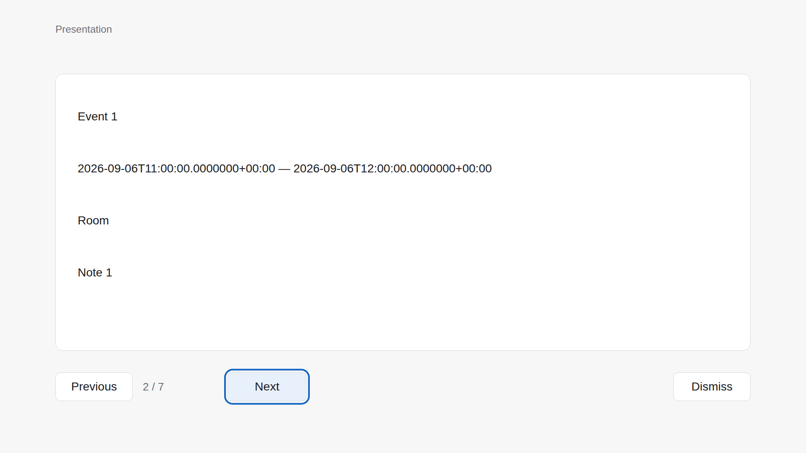

# DisplayPresentation UI parity

Profile: [A2UI and One UI](A2UI_ONE_UI_PROFILE.md).
Single executable preview: [one-ui-sample.html](../refs/one-ui-sample.html).

## 2026-09-06 evidence

The preview fixtures are generated from actual Calendar domain producers, not
handwritten renderer-only data. Regenerate them from the repository root:

```bash
dotnet run --project DisplayPresentation/tests/DisplayPresentation.UseCases.Tests -c Release -- --write-fixtures DisplayPresentation/refs/fixtures.js
python3 DisplayPresentation/tests/check_preview.py --browser-path /path/to/chrome --screenshots DisplayPresentation/docs/images/browser
```

The fixture selector is visible only with `?verify=1`, outside the product canvas.
The regular preview shows the same renderer-owned page navigation as NUI.

| State/check | Browser result | Installed NUI result |
|---|---|---|
| Calendar 0/1/7/100 | Pass; empty placeholder / 4 / 28 / 400 fields; all 100 pages reached | Pending |
| Reminder | Pass; four actual producer fields | Pending |
| Page 2, Next focused | [FHD browser capture](images/browser/presentation-page-2-fhd.png) | Pending |
| Previous/Next/Enter | Pass; page transition and focused Next | Pending |
| 720p, FHD, 4K, 8K, 4:3 | Pass; centered canvas fits viewport and preserves page | Pending native insets/scaling/bounds |
| Escape/dismiss | Pass; neutral empty state, no old content | Pending |
| Malformed/unsupported | Pass; recovery surface, no untrusted partial rendering | Pending |
| Browser console | No errors recorded | Not applicable |
| ViewAnnotation page/control lifecycle | Host paging/store checks pass | Pending measured geometry, focus and actual RPC |



This image is Chromium evidence, not an Aurum/NUI screenshot. The HTML uses the
available host font stack; exact native text metrics and control visuals are not
yet compared. Native captures must be stored separately and labeled with target,
build, viewport, input and state. Loading, payload Button/TextField and native
overlay composition remain unimplemented; renderer navigation does not establish
payload Button support.

## Cross-app flow ledger

| Source | Current evidence | Remaining gate |
|---|---|---|
| Calendar event/reminder ToPresentation | Real host builders parse; generated browser fixtures pass | Installed Action output → Show |
| Calendar/Reminder page/control snapshot | Shared builder parses and round-trips in host tests | Installed View discovery → ToPresentation → Show |
| DisplayPresentation visible page | Four-field semantic slices serialize and parse in order | Native paging → measured View → Presentation → Show |
| Browser | Earlier audit found empty components/incompatible document | Producer repair and fresh audit; not rechecked in this follow-up |
| PhotoGallery | Earlier audit found no Presentation producer | Producer implementation and fresh audit; not rechecked here |

Follow [target validation](TARGET_VALIDATION.md) to close each installed gate.
Compare geometry, spacing, type, colors, states, labels, focus, density and every
supported input mode. A successful build, package or browser run is not native
parity or product completion.

## 2026-09-08 source review

The previously local API14/legacy-binding/paging implementation is now included
in the source delivery. Fresh actionc generation of the complete Presentation and
View categories matches both files byte-for-byte; the five advertised actions and
positional slots match the local catalog. Generated whitespace is preserved as
raw output; authored changes pass whitespace checks.

Domain, Persistence and UseCases host suites pass, including actual Calendar
producer compatibility, bounded binding rejection and page serialization tests.
Release build completes with zero warnings/errors. These are portable/compile
checks, not host execution of managed RPC providers. Production source is unchanged
from the five-app package preparation in [Packages](../../Packages/README.md).
The browser capture and matrices above retain their 2026-09-06 scope; no new
browser, target installation or native acceptance was performed in this review.
Canonical A2UI, overlay hosting and unexercised input/lifecycle cases remain open.
