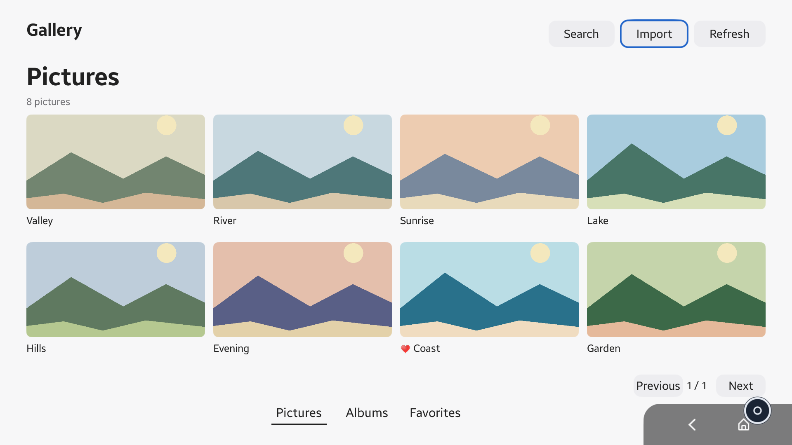
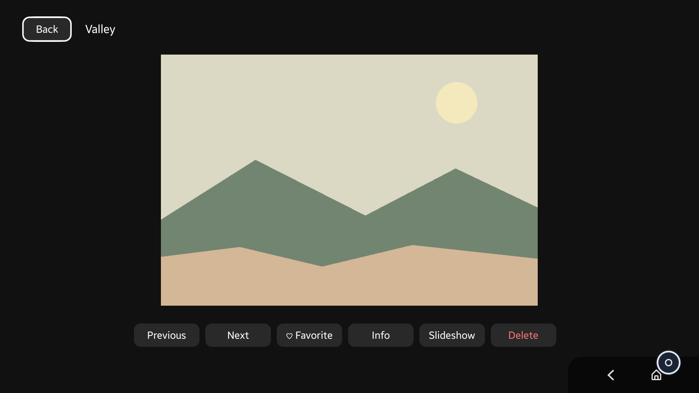
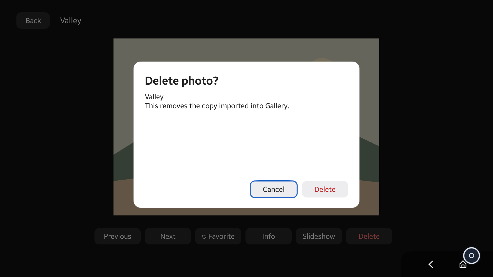

# PhotoGallery

Samsung Gallery의 Pictures·Albums·상세 보기 흐름을 Tizen NUI와 리모컨 입력에 맞춘
.NET API 14 Action Provider 앱입니다. 패키지와 앱 ID는 `org.tizen.photogallery`입니다.

실제 MediaContent 사진을 탐색하고 JPEG/PNG를 Gallery 앨범으로 복사해서 가져옵니다.
즐겨찾기는 재시작 후 유지됩니다. 삭제는 이 앱이 가져온 복사본에만 적용되며 원본은
보존합니다. 사진/앨범/즐겨찾기, 검색, 상세 정보, 슬라이드쇼, 삭제 확인을 제공합니다.



| 상세 보기 | 삭제 확인 |
|---|---|
|  |  |

이미지는 Common Emulator/Aurum으로 캡처한 실제 앱입니다. 테스트 전용으로 제작한
로컬 PNG를 public Action으로 가져왔으며 제품 패키지에는 샘플 사진을 넣지 않습니다.
오른쪽 아래 Back/Home 영역은 에뮬레이터의 시스템 UI입니다.

촬영: 2026-09-06/07, Tizen 10.1 Unified Common Emulator, `emulator-26111` FHD(1920×1080), `emulator-26101` UHD/DCI 4K.
저장소 Aurum wrapper의 키·좌표·screenshot RPC를 사용했으며, 빈 accessibility
tree는 실측 View bounds로 보완했습니다. SystemInfo와 WindowSize/GetInsets를
읽어 단일 ancestor transform으로 화면과 모달을 함께 확대합니다.

```sh
./test.sh             # 5개 호스트 테스트 프로젝트
./build.sh            # .NET/API14 Release 빌드
./build.sh generate   # 전체 Photo 8 / Custom 2 / View 4 재생성
./package.sh          # dist/에 에뮬레이터 서명 TPK 생성
```

- [개발 및 Action 계약](docs/DEVELOPMENT_GUIDE.md)
- [검증 결과와 제한](docs/STAGE2_VALIDATION.md)
- [HTML/NUI 비교](docs/UI_PARITY.md) · [실행 가능한 프리뷰](refs/one-ui-sample.html)
- [English](README_Eng.md)

8K는 호스트 스케일 TDD PASS입니다. **Unverified on target due to emulator DRM
constraint**. TV 제품·실물 USB·물리 터치 지원을 Common Emulator 결과로 주장하지 않습니다.
