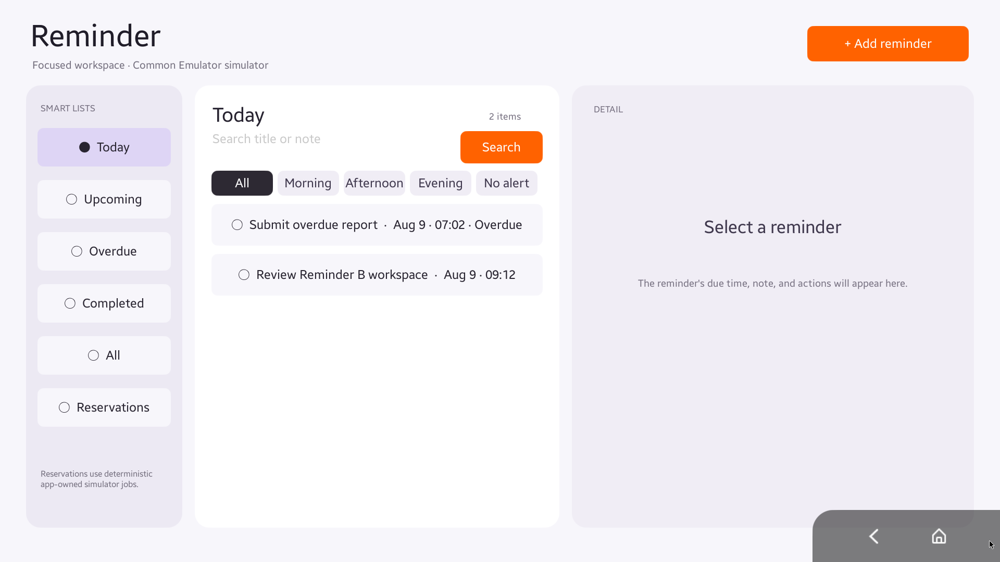
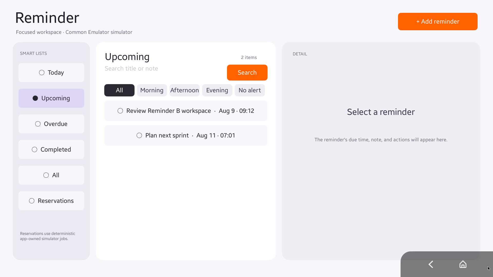
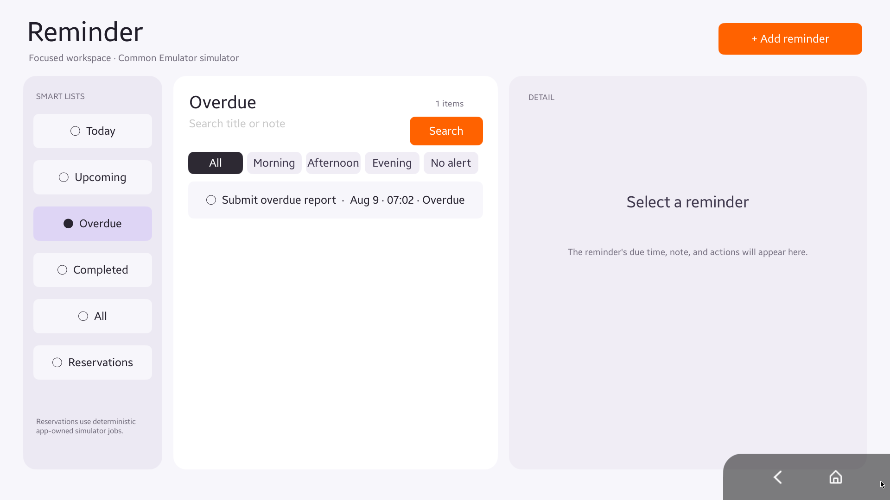
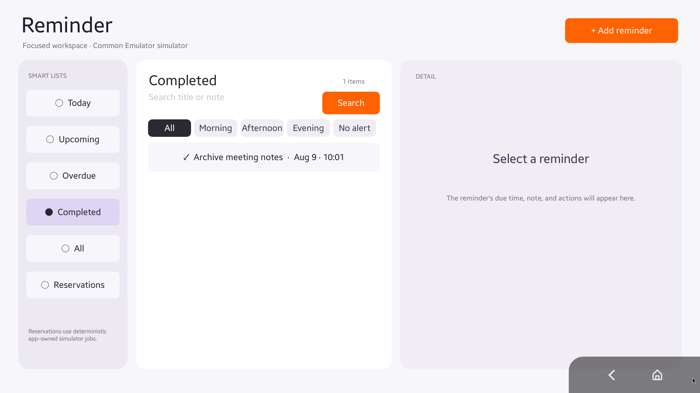
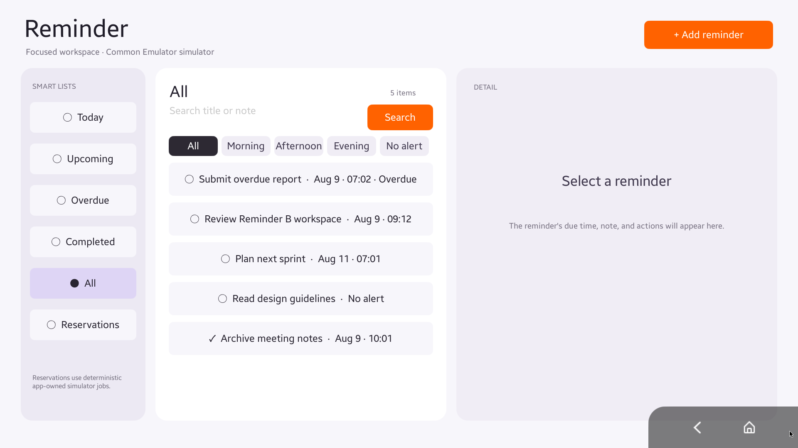
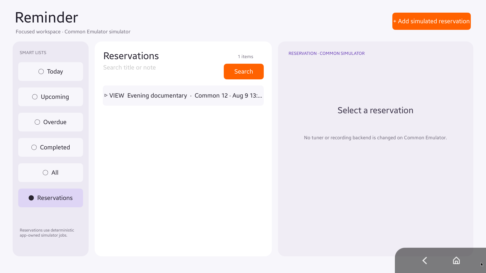
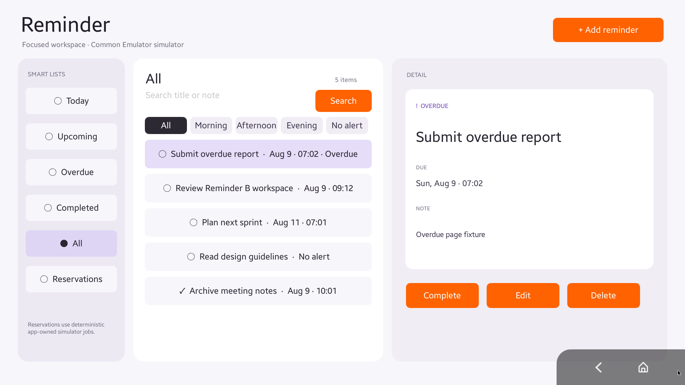
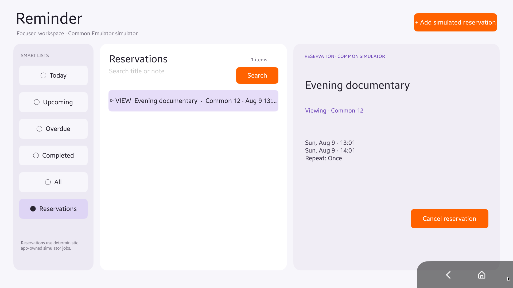
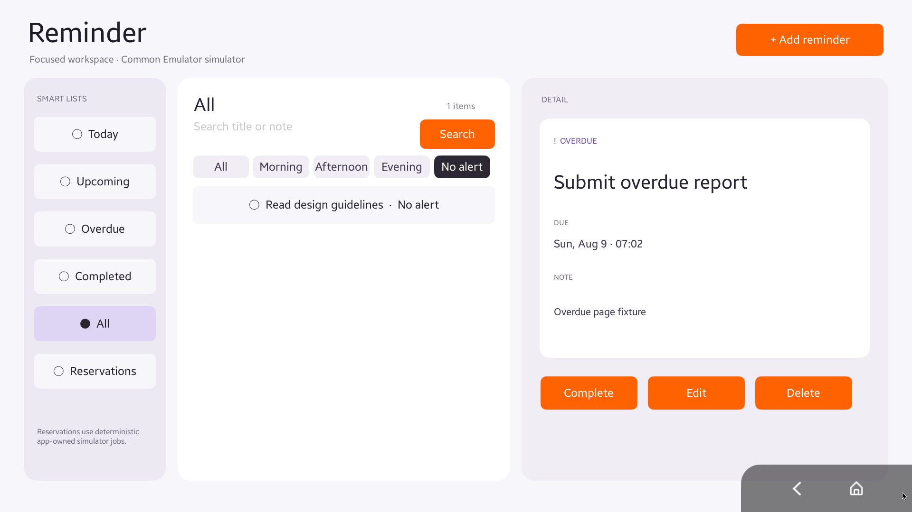
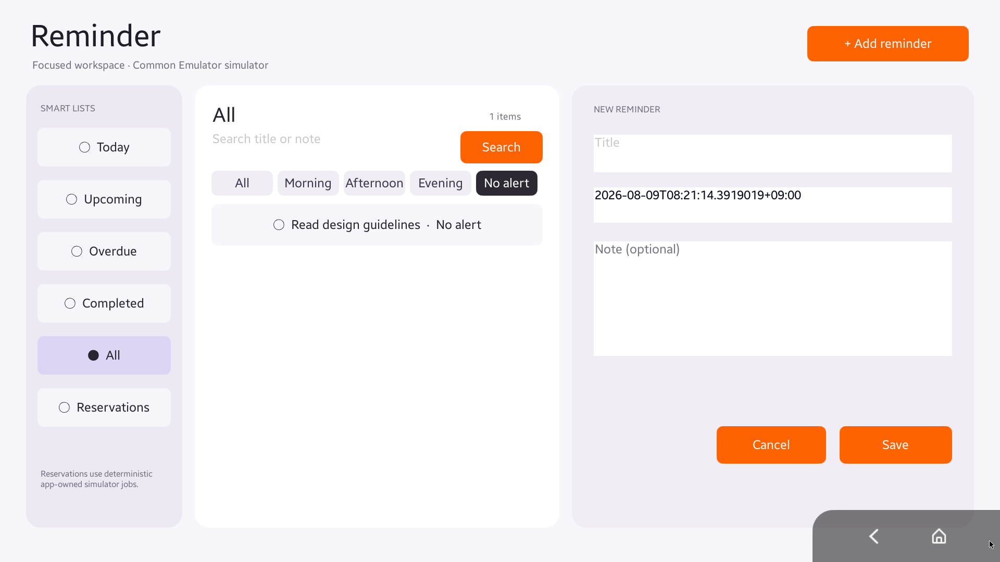

# Reminder

Production-style Tizen NUI example for the complete `Tizen.Action.Schedule` category.

- **Product shell:** approved B Focused Workspace — smart navigation, bounded list, detail/editor
- **App ID:** `org.tizen.actionexamples.reminder`
- **Target:** Tizen 10.1 Common Emulator compatible package, Tizen.NET 13
- **Actions:** all 10 Schedule methods
- **View:** current `ScreenBounds` / `WindowBounds` / `Annotation.EntityInfo` contract
- **Common behavior:** viewing/recording reservations are deterministic app-owned simulations, not TV tuner operations

Architecture keeps `Reminder.Domain`, `Reminder.Persistence`, and `Reminder.UseCases` free of Tizen runtime dependencies. NUI, Schedule RPC, and View RPC are adapters around the same `ScheduleService` instance.

See [approved requirements](docs/REQUIREMENTS_DRAFT.md), [architecture review](docs/REQUIREMENTS_ARCHITECTURE_REVIEW.md), and [build/E2E guide](docs/BUILD_E2E_GUIDE.md).

## Primary pages

The six smart-list pages below were opened through the repository Aurum UI-automation wrapper using remote Down/Enter input. Deterministic fixtures were created through the app's public Schedule Actions; the app data file and platform databases were not edited directly.

| Today | Upcoming |
|---|---|
|  |  |

| Overdue | Completed |
|---|---|
|  |  |

| All | Reservations |
|---|---|
|  |  |

The Today fixture also demonstrates that an item due earlier on the current day remains part of Today while receiving an explicit `Overdue` state. Upcoming excludes the overdue item. Completed is visibly distinct from active reminders. Reservations are explicitly labeled as Common Emulator simulations.

## Detail, filter, and editor states

| Reminder detail and actions | Reservation detail and cancel action |
|---|---|
|  |  |

| No-alert filter | New reminder editor |
|---|---|
|  |  |

The reservation route is navigable by D-pad as `Reservations → Search → first reservation`. Since Reservations has no time filter row, Down from Search goes directly to the first reservation rather than attempting to focus a hidden filter.

## Proportional viewport scaling

Both Reminder and Calendar use the live NUI window dimensions supplied by the platform through `Window.Default.WindowSize`. They do not assume that the active surface is always 1920×1080.

Reminder derives a centered proportional canvas from a 1920×1080 design space:

```text
scale         = min(windowWidth / 1920, windowHeight / 1080)
contentWidth  = 1920 × scale
contentHeight = 1080 × scale
offsetX       = (windowWidth  - contentWidth)  / 2
offsetY       = (windowHeight - contentHeight) / 2
```

- Root-level header and three panes receive the centered canvas offsets.
- `Window.Default.GetInsets()` constrains the available platform area before scale and centering are calculated.
- Coordinates inside each pane remain local and use the same uniform scale.
- Font sizes, spacing, pane bounds, cards, buttons, borders, and focus geometry share the uniform scale.
- The root background still fills the complete physical window.
- `Window.Default.Resized` or `Window.Default.InsetsChanged` triggers a fresh render, so runtime window/inset changes do not retain stale geometry.
- Actual NUI geometry remains the source for published `ScreenBounds` and `WindowBounds`.

The Tizen-free viewport tests cover:

| Window | Scale | Centered offset | Purpose |
|---|---:|---:|---|
| 1920×1080 | 1.0 | 0, 0 | reference canvas |
| 1280×720 | 0.6667 | 0, 0 | smaller 16:9 device |
| 1440×1080 | 0.75 | 0, 135 | 4:3 vertical letterbox |
| 2560×1080 | 1.0 | 320, 0 | ultrawide horizontal letterbox |

The native screenshots in this README are from a 1920×1080 Common Emulator. The 1280×720 and non-16:9 entries are deterministic geometry-test coverage, not a claim that a second native Emulator profile was captured.

## UI-automation provenance

All ten screenshots were freshly captured from the packaged and installed TPK on 2026-08-09.

- target: `emulator-26101` (`tc-0808-1`)
- profile: Public Tizen Common Emulator
- resolution: 1920×1080
- app ID: `org.tizen.actionexamples.reminder`
- automation: `.agents/skills/tizen-aurum-ui-automation/scripts/aurum-ui`
- input: Aurum remote-key and coordinate-click RPCs
- capture: native Aurum screenshot RPC
- image verification: ten PNG files, each exactly 1920×1080

The Aurum accessibility tree on this Emulator returned `root_count: 0`; therefore the verification uses remote-key state transitions plus pixel screenshots rather than claiming semantic element lookup. The lower-right Back/Home area is the Common Emulator platform overlay.

## Verification summary

- `Reminder.Core.Tests: PASS (30 assertions)`, including four viewport shapes, platform insets, and invalid-size rejection
- `Reminder.ActionProvider.Tests: PASS`
- Reminder App Release build: 0 warnings, 0 errors
- latest TPK archive payload/signatures verified, installed, and launched
- all 10 Schedule Actions exercised through the generated device wire path
- all four View Actions plus missing-ID failure exercised
- six primary pages and four interaction/detail states captured from the final package
