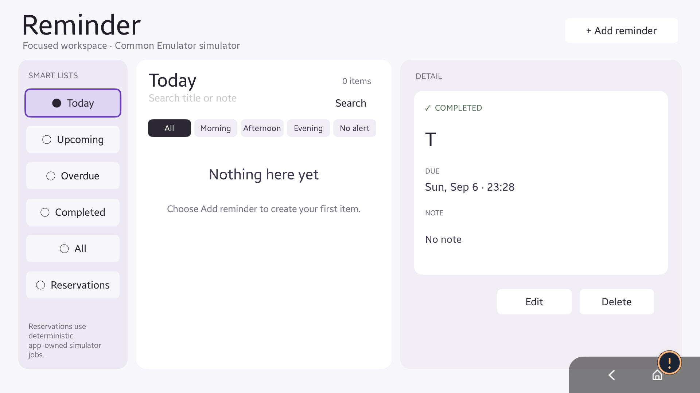
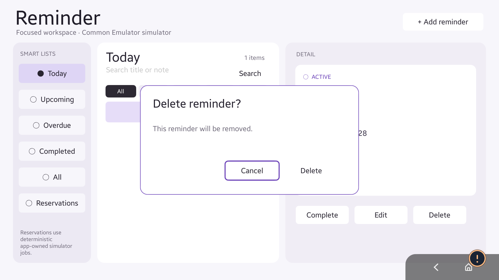
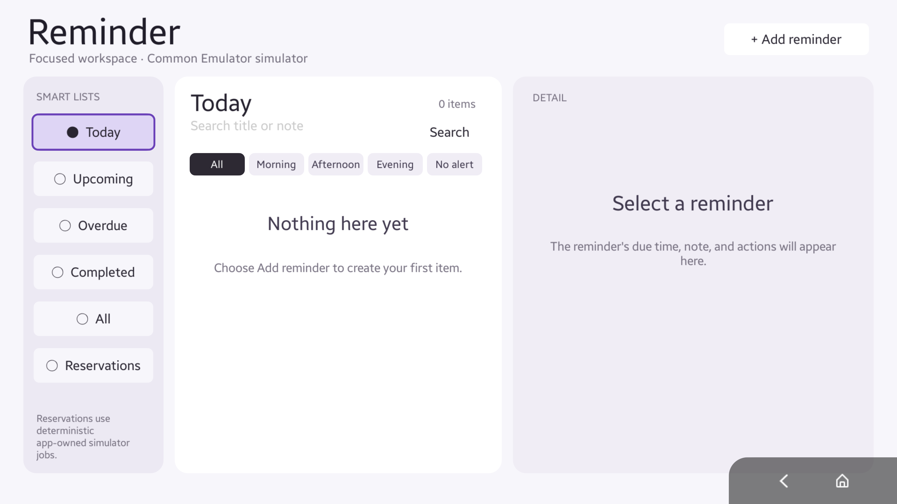
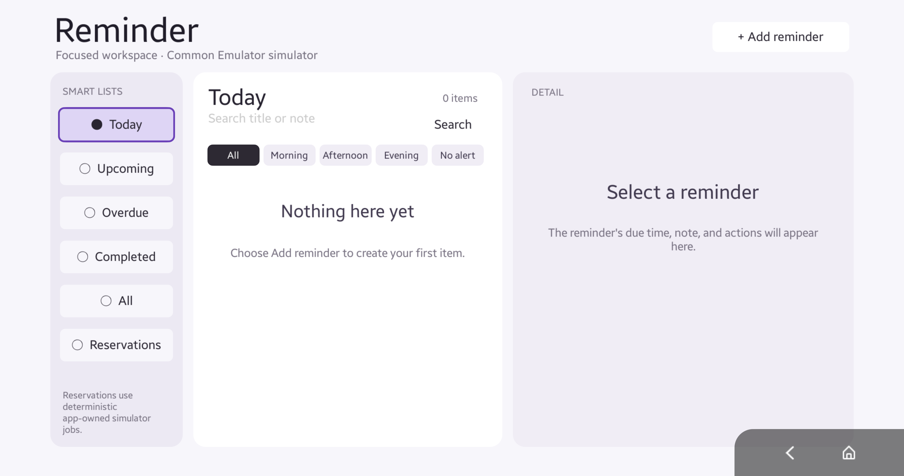

# Reminder

Tizen NUI/API 14 Reminder provider with smart lists, detail/editing, completion,
delete confirmation, current ViewAnnotations and Presentation integration.

- App ID: `org.tizen.actionexamples.reminder`
- Standard Reminder: Add, Delete, Search, ToPresentation, Update
- ReminderCustom: AddRecording, AddViewing, CancelRecording, CancelViewing, GetReminderByIds, GetReservations
- View: FindById, GetAnnotatedViews, GetFocusedView, ToPresentation
- Reservations are deterministic app-owned Common Emulator simulations.

UI and providers share the same use-case service and repositories. Domain,
persistence and use-case tests run without Tizen runtime assemblies. Providers
inherit complete actionc-generated classes; generated originals are not patched.

See [build and target commands](docs/BUILD_E2E_GUIDE.md),
[stage 1 verification](../Calendar/docs/STAGE1_VALIDATION.md),
[View contract](docs/VIEW_ANNOTATION.md), and [preview parity](docs/UI_PARITY.md).
The executable [One UI adaptation preview](refs/one-ui-sample.html) models the
existing Tizen three-pane layout; it is not an Action runtime or requirements doc.

## Current API 14 native evidence

| UHD 3840×2160 | DCI 4K 4096×2160 |
|---|---|
|  |  |

## Resolution and evidence boundaries

Initialization reads public SystemInfo screen capabilities and NUI WindowSize /
GetInsets. The actual drawable window determines a centered 1920×1080 reference
canvas with `scale = min(availableWidth/1920, availableHeight/1080)`. One ancestor
transform scales layout, PixelSize typography, radius, border and focus geometry.
Children use design units. Resize/inset changes update the transform while
preserving unsaved editor state and focus; invalid geometry retains the frame.
Annotations publish finite positive measured native bounds with no size fallback.

The final evidence record distinguishes host tests, API 14 builds, signed TPKs,
action-tool calls, UI interactions and native resolution measurements. The Common
Emulator's SystemInfo capability can remain 1280×720 on a larger native window.
Aurum tree returned empty roots; captures use remote keys and calibrated native
coordinates. The lower-right Back/Home overlay belongs to the emulator.

## Historical API 13 UI reference (2026-08-09)

The six smart-list pages below were opened through the repository Aurum UI-automation wrapper using remote Down/Enter input. Deterministic fixtures were created through the app's public Schedule Actions; the app data file and platform databases were not edited directly.

| Today | Upcoming |
|---|---|
|  |  |

| Overdue | Completed |
|---|---|
|  |  |

| All | Reservations |
|---|---|
|  |  |

The Today fixture also demonstrates that an item due earlier on the current day remains part of Today while receiving an explicit `Overdue` state. Upcoming excludes the overdue item. Completed is visibly distinct from active reminders. Reservations are explicitly labeled as Common Emulator simulations.

## Detail, filter, and editor states

| Reminder detail and actions | Reservation detail and cancel action |
|---|---|
|  |  |

| No-alert filter | New reminder editor |
|---|---|
|  |  |

The reservation route is navigable by D-pad as `Reservations → Search → first reservation`. Since Reservations has no time filter row, Down from Search goes directly to the first reservation rather than attempting to focus a hidden filter.

The gallery above predates the API 14 migration. It documents historical page structure; use the current evidence links for final-package acceptance.
